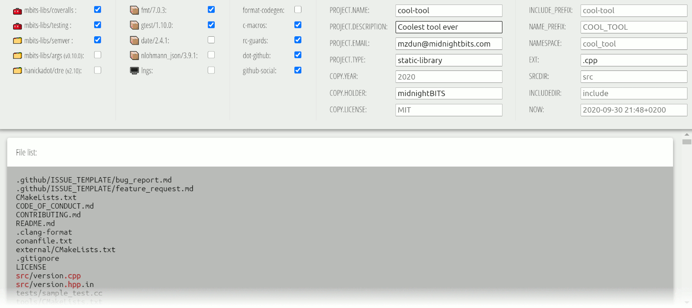

# Create project from template
Provides a starting point for a new project.

- Start with `python server.py`,
- Navigate to http://localhost:8000/app/,
- Select tools and libraries
- Fill out rest of the form
- Go to the bottom
- Save the minimal JSON for Mustache context
- Finish with `python project.py config.json ../<project-dir>`
- Profit
